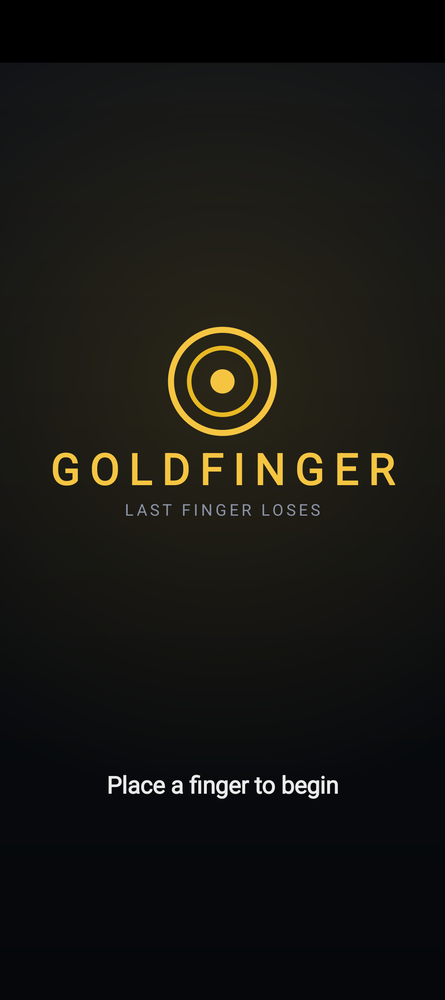
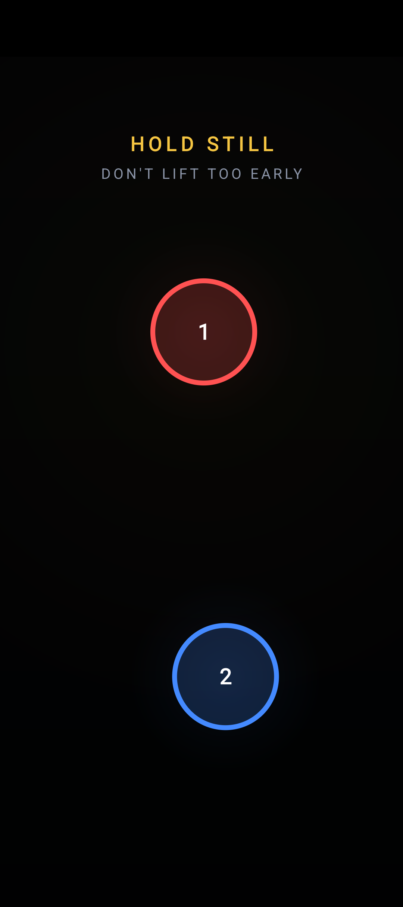
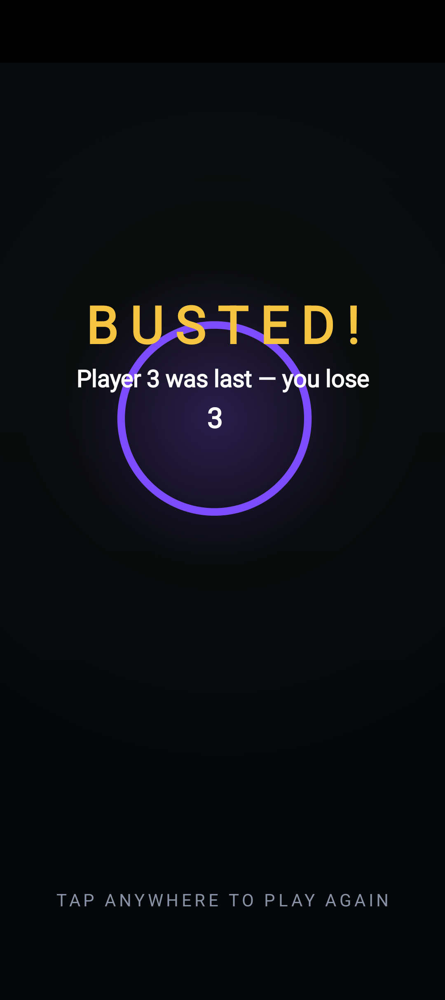

# Goldfinger

**A fast, tense multiplayer party game for Android — last finger standing loses.**

[](https://github.com/supamanluva/goldfinger/actions/workflows/build.yml)
[](LICENSE)

Goldfinger is a single-device reaction party game inspired by the classic 2009
mobile hit. Put the phone on the table and everyone places a finger on the
screen. Tense music builds… then the alarm blares and everyone snatches their
finger away as fast as they can.

**The slowest to react is the _Goldfinger_ — and the Goldfinger buys the next
round.** 🍺 Lift too early, before the alarm, and you're the Goldfinger too.
Quick fingers are safe.

## Screenshots

| Title screen | In play | Busted |
|:---:|:---:|:---:|
|  |  |  |

## How to play

1. Lay the phone flat. Each player places **one finger** on the screen (2+ players).
2. After a short moment the round arms and tense music plays. At a **random time
   (3–20 s)** an alarm blares.
3. **False start:** lift your finger *before* the alarm and you're the Goldfinger instantly.
4. When the alarm sounds, everyone lifts as fast as they can.
5. The **last finger** on the screen is the **Goldfinger** — and the Goldfinger buys the next round.

Tap anywhere to play again.

## Features

- True multi-touch — one glowing, numbered ring per player.
- Real-time synthesized audio: tension music + alarm siren (no audio assets).
- Haptic feedback, immersive fullscreen, keep-screen-on.
- Polished dark theme with a gold wordmark and adaptive launcher icon.
- Zero third-party dependencies — pure Android SDK + Kotlin.

## Tech

| Area | Detail |
|------|--------|
| Language | Kotlin |
| UI | Custom `View` + `Canvas` (no XML layouts, no Compose) |
| Audio | `AudioTrack` real-time synthesis (`SirenPlayer`, `MusicPlayer`) |
| Min / Target SDK | 23 / 34 |

Source: [`app/src/main/java/com/goldfinger/app/`](app/src/main/java/com/goldfinger/app)

## Build

### Option A — Android Studio
1. Install [Android Studio](https://developer.android.com/studio).
2. *File → Open…* and select this folder; let Gradle sync.
3. Connect a real phone (multi-touch needs hardware) and press **Run ▶**.

### Option B — Command line (Gradle wrapper)
```bash
./gradlew assembleDebug
# Output: app/build/outputs/apk/debug/app-debug.apk
```

## Continuous builds

Every push to `main` builds the APK via GitHub Actions and uploads it as a
workflow artifact. Pushing a tag like `v2.0` additionally attaches the APK to a
GitHub Release:
```bash
git tag v2.0
git push origin v2.0
```

## Trademark note

This is an independent, non-commercial fan project. "Goldfinger" and any similar
names may be trademarks of their respective owners. Rename and re-skin before any
public distribution.

## License

[MIT](LICENSE)
